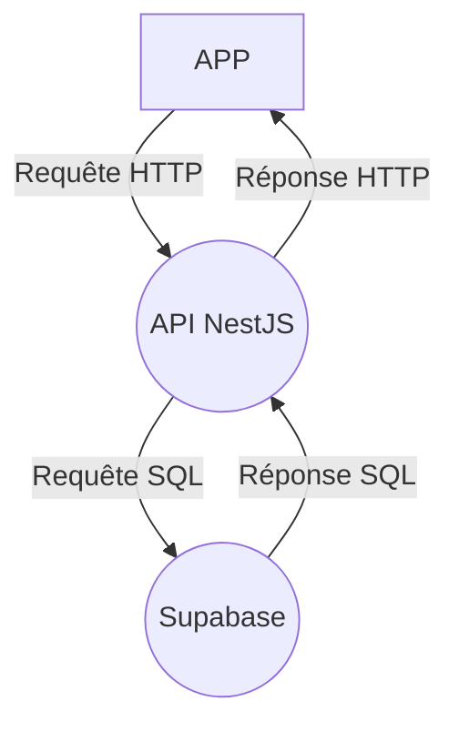

fredguez@gmail.com

# Brevlin API

## Description

API pour l'APP Brevlin

## Technologies

- Node.js
- NestJS
- Supabase (PostgreSQL)

## Diagramme de l'écosystème

## A faire

- Si la personne est déjà en attente d'inscription, ça ne lui envoie pas de mail
- Agencer la page d'inscription
- Clean le code

## Nouveau

- La personne contacté aura son compte créé et sera rattaché à l'école dirèctement
- Perm admin il pourra ajouter d'autres admins, profs et elèves, créer des classes et ajouter des élèves à ces classes
- ...

Upload :

upload/u/:id/:filetype/:filename/:uid

u = user
id = id de l'utilisateur
filetype = type de fichier (avatar, post, ...)
filename = nom du fichier
uid = id du fichier

s = school