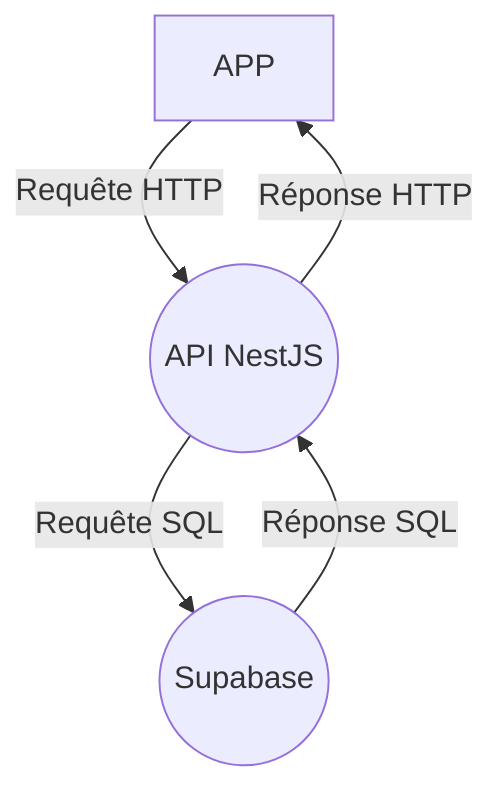

# Brevlin API

## Description

API pour l'APP Brevlin

## Technologies

- Node.js
- NestJS
- Supabase (PostgreSQL)

## Diagramme de l'écosystème

## A faire

- Si la personne est déjà en attente d'inscription, ça ne lui envoie pas de mail
- Auth : Bouton chargement
- Agencer la page d'inscription
- Clean le code
- Modifier le mail de confirmation
- Page verify